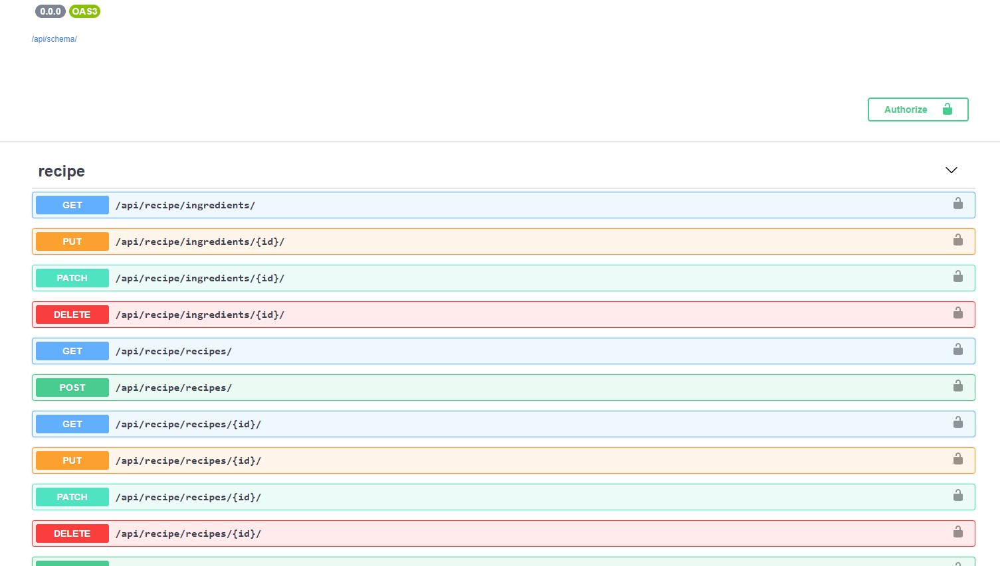
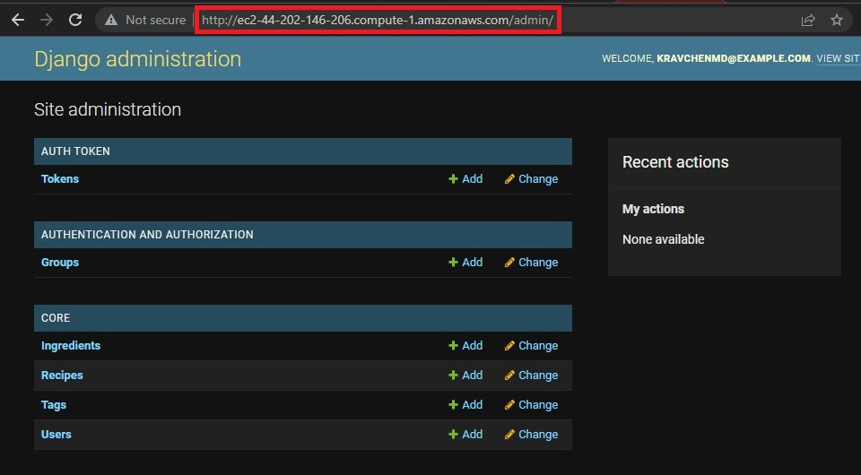
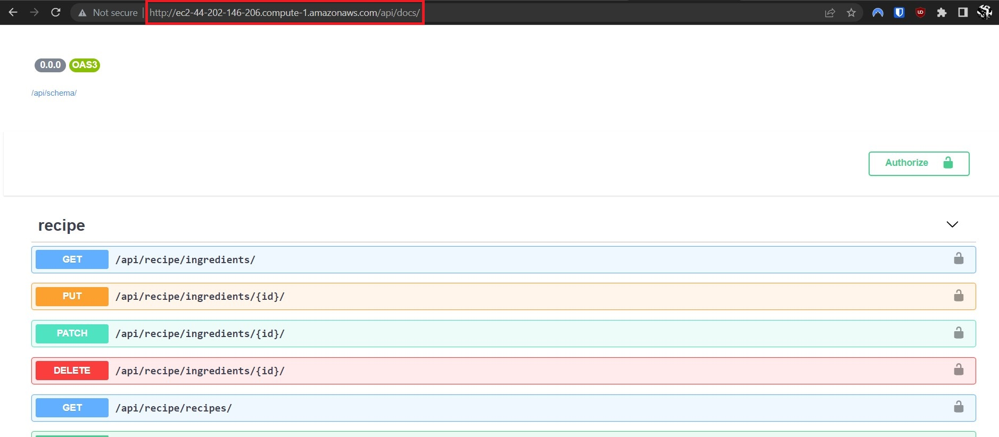
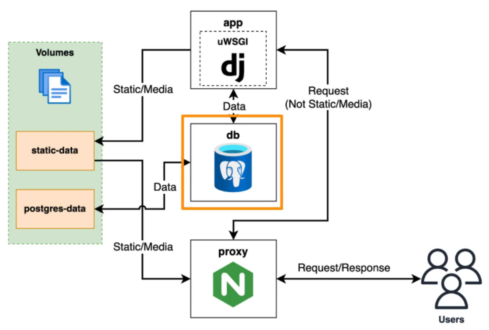
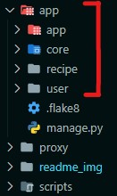
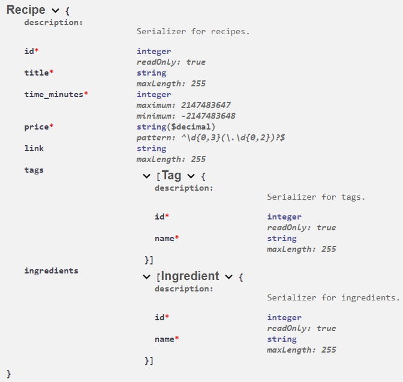
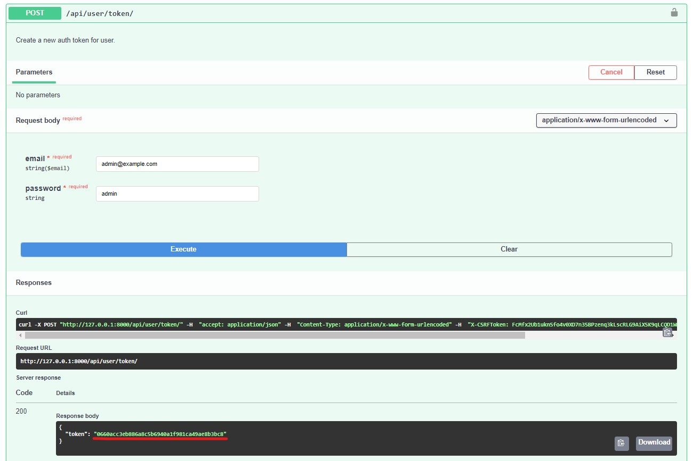
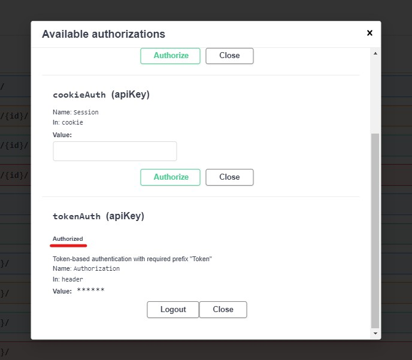
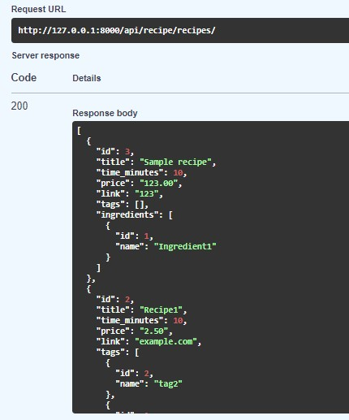

# Recipes app (Django, REST API)

## Description

**Django** web app for storing recipes of the user with a backend REST API, without custom front-end (only Django admin and API docs). The app has the following features:

- Project is developed using Test Driven Development (**TDD**) approach;

- REST API is built using **Django REST framework**;

- App runs in the **Docker container**  (with lightweight requirements and removing unneeded temp files by bash scripts after building). **Docker compose** is used for configuring;

- **PostgreSQL** is used as DB (configured using Docker compose), together with `psycopg2` adapter (non-binary build);

- Authentication of a user is done via generated *token*;

- `drf-spectacular` OpenAPI 3 schema generation using the swagger tool (swagger docs);

- **Git actions** are used for testing and linting (using `flake8`) via Dockerhub authentication.

### Deployment

For the full development cycle the project was deployed App was deployed using a single virtual private server (**VPS**) on **AWS (EC2)** inside the Docker container:

### App structure

- HTTP Requests to the Django service are handled using **NGINX** reverse proxy server.
- **uWSGI** server is used to serve Django app.
- Separate volumes are for storing static and DB data.

## Functionality

The structure of the project is divided to:
- the main *app* application;
- *core* application for the management and storing of migrations, models, and admin customization;
- *recipe* and *user* applications for separating functionality (serializers, views, etc.)

A user's recipe has the following fields (swagger schema):

### Other features:

- Image uploading and storing are implemented using `Pillow`.

- Recipes can be filtered by IDs of ingredients and/or tags. Tags and ingredients can be filtered by being assigned to a recipe. For filtering OpenAPI schema was extended manually.

- Separate APIs for form data and for handling image upload (to make API data structure simpler and cleaner)

- *Tags* and *ingredients* are stored as separate tables in the DB with **many-to-many** relationships.

- Race condition with DB during the app start is handled by the custom Django management command `wait_for_db`

- *APIViews* are used for User, while *Viewsets* are used for recipes because of pure CRUD operations for the recipe model.

- Configuration is handled using environment variables.

## Functionality examples

- Generating a token for a user:

- Authorization using the token:

- Example of a response for getting recipes HTTP request:

**_Kravchenko Michail_**
