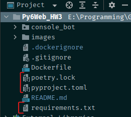
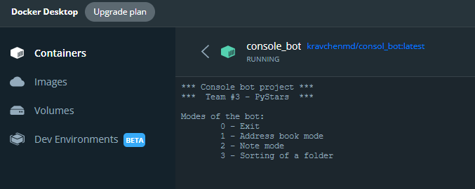
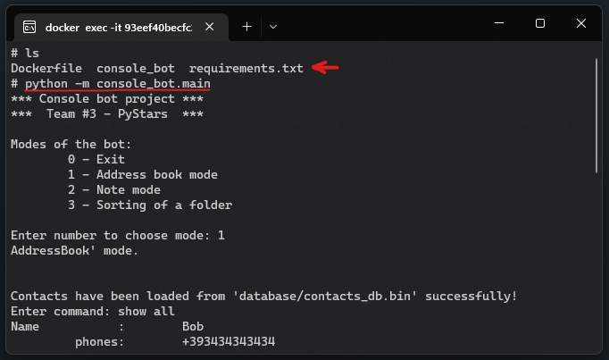
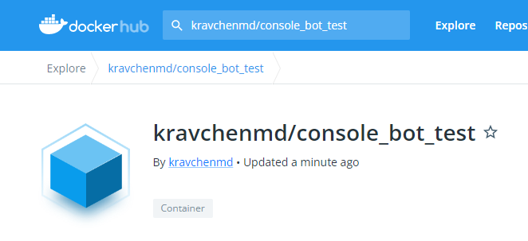

# Docker image

## Preparing the environment for Docker

- Virtual env is created using `poetry`
- Files `.toml`, `.lock` are generated
- File `requirements.txt` for Docker is generated as well

## Building the Docker image

- Docker image is built
- Application starts in the container:

- It's possible to start the app via CLI of the container:

- Finally, the image was successfully uploaded to DockerHub:

