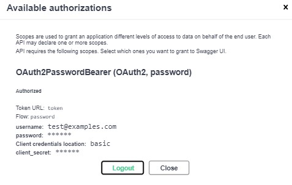

# User notes app (FastAPI)

## Description

**FastAPI** web app for user's notes of the user with a backend REST API, only with API docs interface. The app has the following features:

-  Cloud-based **PostgreSQL** (ElephantSQL) is used as DB, together with `psycopg2` adapter;

- Authentication of a user is done using **JWT** (JSON Web Token) as **OAuth 2.0** Bearer Tokens;

- User password is hashed using `CryptContext`(with `bcrypt` schema) and stored in encrypted form in the DB;

- Authentication, Note and User models are implemented separately;

- DB migrations are managed by `alembic`.

## Functionality examples

- Creation/registration of a user:

- OAuth2 authorization:

 

- Logging in and getting the JWT token:

- Example of a response for getting user's notes:

 

**_Kravchenko Michail_**
