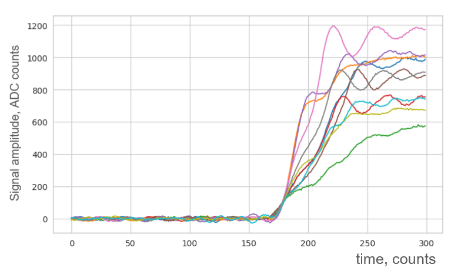
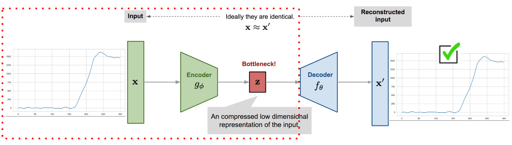
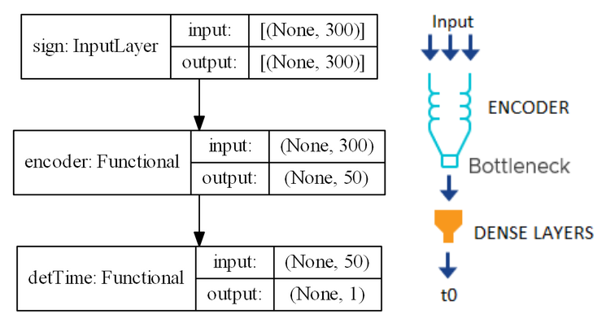
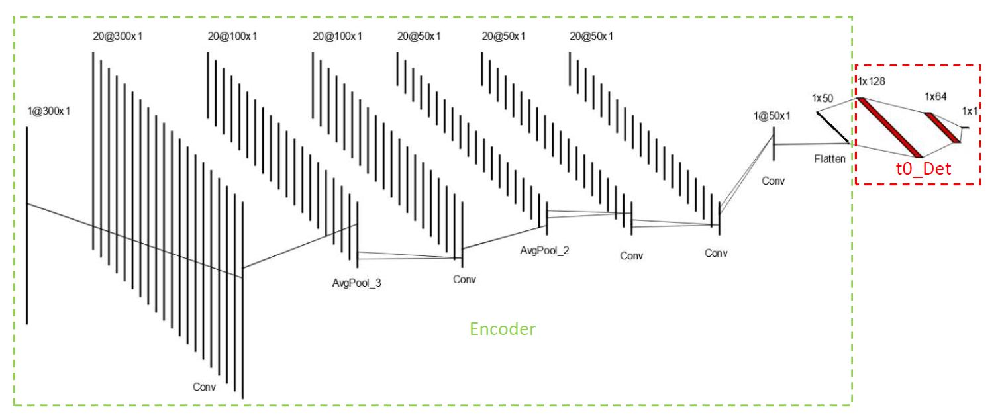
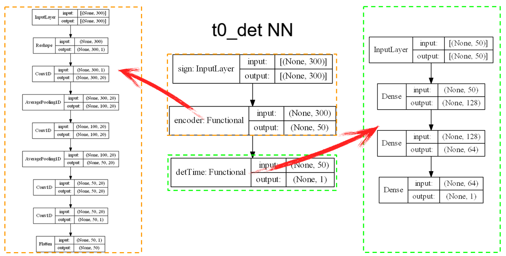

# ML-HPGe-timing

Deep learning-based pulse shape analysis for improving the time resolution of the high-purity Germanium detectors

## Note

Included Jupyter notebooks present only the main results for demonstration purposes:
* "HPGe_time_(CNN_API_Robust)" notebook shows the latest results at the moment;
* "HPGe time (GridSearch)" shows results of choosing optimal parameters for CNN layers.

## Description

### The MuX experiment

When registering signals by a particle detector in many cases it's crucial to know the exact time of a particular event. For example, [the MuX experiment](https://www.psi.ch/en/ltp/mux) (PSI, Switzerland) performs muonic atom spectroscopy by detecting the X-rays emitted from a muonic atom from the muonic atoms (the hydrogen-like bound state of a negative muon with a nucleus). The X-rays are detected by high-purity germanium detectors, and knowing the exact time of an X-ray hit is crucial for the aims of the experiment.

### ELET algorithms vs deep learning-based approach

Conventional Extrapolated Leading-Edge timing (ELET) algorithms are used to improve the time resolution of particle detectors. However, these algorithms have some significant cons:
* A need for a single set of parameters for a predefined function for the whole energy range;
* Can involve complex computations, which could make it unsuitable for online use;
* Manual optimization.

Another possible way is using deep learning-based approaches by building and training a neural network that can learn the relationship between signal shape and time of signal rising edge. It would allow to:
* Automate the process;
* Use it online, since the main computational load is shifted to the offline training phase.
* Having a more generalized approach: the built network can be used for different detectors with different electrical characteristics (gain, etc.)

the pre-trained CNN-based encoder (for compression of the original signal and extracting a feature vector) followed by a couple of dense layers (for determining the exact time of the signal rising edge). Pending task. Achievement of fairly good and promising interim results compared to conventional, non-ML based, algorithms: comparable and even slightly better time resolution, good metrics (relatively small MAE value, acceptable MSE value, r-squared value ~0.85-0.9), reproducible results for different datasets (with ~300-800k signal samples).

## NN for determining the time of the signal rising edge

### The idea

The registered signal is digitized and represented as a 1-dimensional vector with a width of 300 ADC samples. Thus this is a typical time series analysis task.

In the first stage, the CNN-based Autoencoder is used to compress the original signal and extract a 50-dimensional feature vector at the bottleneck:

The Decoder part of Autoencoder is replaced by a couple of regular ANN consisting of 2 Dence layers:
(IMAGE:  En_TimeDet.png)
At this stage Encoder is already pre-trained and fixed, only the part with dense layers is fitted to the data. The original values time of signal rising edge t0 is used as labels.

The pre-trained Encoder + Dence layers architecture is picked instead of just ANN of several dense layers because using CNN in the Encoder part allows reducing the dimension of input data by 6 times. Secondly, CNNs use fewer parameters.
For example, the structure of the NN for determining the signal rising edge time value is presented below:

The Encoder consists of 4 Conv1D convolutional layers (with 20 filters and kernel size equals 7), each followed by an AveragePooling1D layer. Then here comes a couple of Dence layers with 128, 64 neurons. The output neuron gives the predicted value of t0 predicted. The NN with such a design has `20, 790 parameters` in total (including 5, 941 pre-trained Encoder parameters):

Connecting the 300-dimensional input layer directly with only 128 and 64 interim fully connected Dence layers gives `46, 849 parameters` in total. Then the use of the CNN-based Encoder part allows a gain in a number of model parameters more than twice.

### Detailed current structure of the NN

### Model highlights 
* Dimensionality of the signal is reduced by pooling layers in the Encoder part in 2 steps: at first by 3 times and then by 2 times, by 6 times in total.
* The number of filters and kernel size were optimized using the GridSearch and Tensorboard toolkit for visualization of the results. The values of 20 and 7, respectively, were found as optimal ones based on the performance of the Autoencoder.
* RobustScaller was chosen for scaling the signals (input features) due to the presence of outliers in signals after splitting the dataset and fitting the scaler only on the part used for training the NN.

## Current results
The NN shows good and promising interim results compared to conventional ELET algorithms:
|Algorithm| Time resolution |
|--|--|
| ELET | typically up to 10 ns |
| DL-based | here: ~ 10 ns* |

\* *average time resolution is ~2.6 of ADC counts, which is equivalent to ~10 ns, considering the ADC sampling rate of 250 MHz* 

According to the metrics, MSE and RMSE values are higher than MAE values, which might be caused by data quality (noises, errors in manual labeling of datasets that were used for training, etc.)
