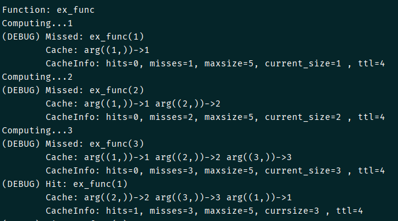
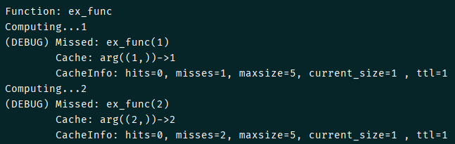
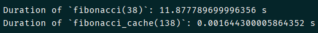

# Algorithm of Least Recently Used (LRU) caching

## Description

- LRU-caching is implemented using **doubly linked list** (with base element of `Node` class)
- Following articles are taken as basis:
    - [LRU cache on Python](https://www.geeksforgeeks.org/python-lru-cache/)
    - [Implementation of TTL](https://realpython.com/lru-cache-python/#adding-cache-expiration)

- List of improvements:
    - LRU-cache is implementer using class decorators
    - Classes are implementer using **dataclass**
    - There are two classes: parent class `LRUCache` (pure caching) and it's child `TimedLRUCache` (with TTL)
    - Class `TimedLRUCache` (or `LRUCache`) is wrapped with the function decorator `lru-cache`  in order to have a
      possibility to use decorator with and without passing the arguments (`max_size` and `ttl`)
    - TTL (corresponding fields and cleaning of cache) is happened only if parameter `ttl` is passed to the
      decorator `@lru_cache` (with non-default value)
    - Debug-output is implemented (bool field `DEBUG` of class `CRUCache`): cache and its parameters `hits`, `misses`
      , `max_size`, `current_size` и `ttl` (optionally) at the moment are printed

## Results

As an example of the workability the function `example_debug_ttl()` that just print its argument and delays script for
1 second is used (with DEBUG-mode):

- with parameters `max_size=5` `ttl=4` (hits are happened)

- with `max_size=5` `ttl=1` (cache is not growing since it is cleaned each second (equal to the time of the delay)

In order to check the improvement in calculation time the function `example_fibonacci()` is user. Within this function
two functions that calculate Fibonacci sequence - simple `fibonacci` and `fibonacci_cache` that is wrapped
by the `@lru_cache` decorator - are executed:

**_Kravchenko Michail_**
