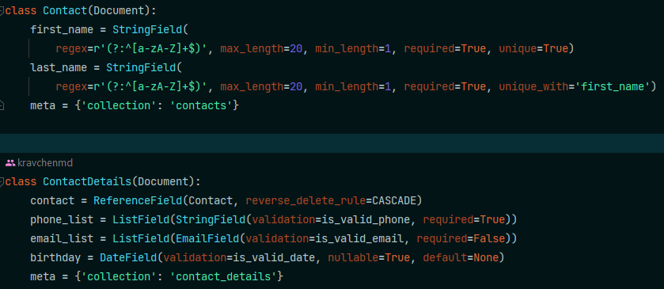
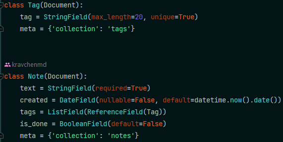
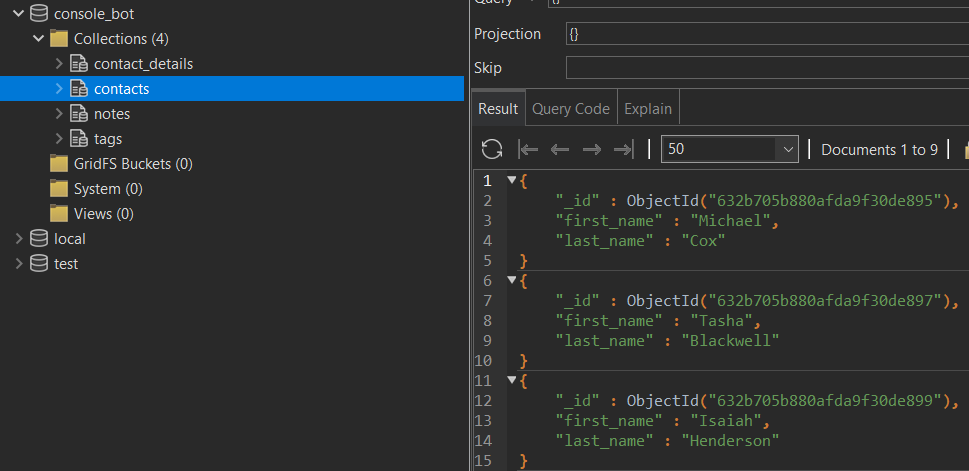

# Console bot (using MongoDB)

## Description

- Managements of the DB is curried out using **mongoengine**
- Relationship between `Contact` and `ContactDetails` classes is implemented via field `contact` (with `ReferenceField`
  type) in the `ContactDetails` class
- The relationship is of **many-to-many** type: field `tags = ListField(ReferenceField(Tag))` in the class `Note`
- Validation of the fields is implemented using built-in validation of 'mongoengine': type of filed is specified
  explicitly (for example `EmailField`) and using the parameter `validation` in method `.validate()` when new
  contact/note is created

## DB scheme

**Address book:**

**Notebook:**

## Results

**_Kravchenko Michail_**
