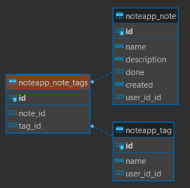
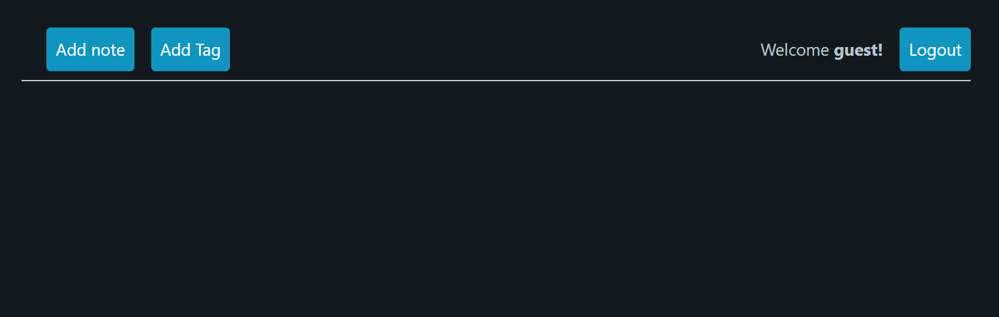
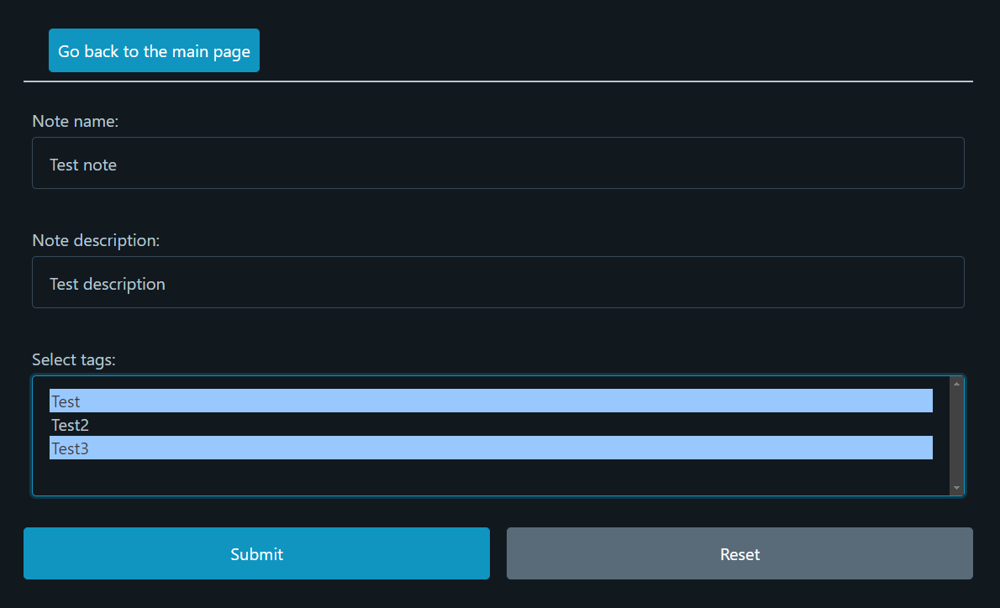
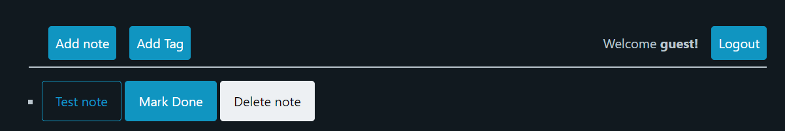
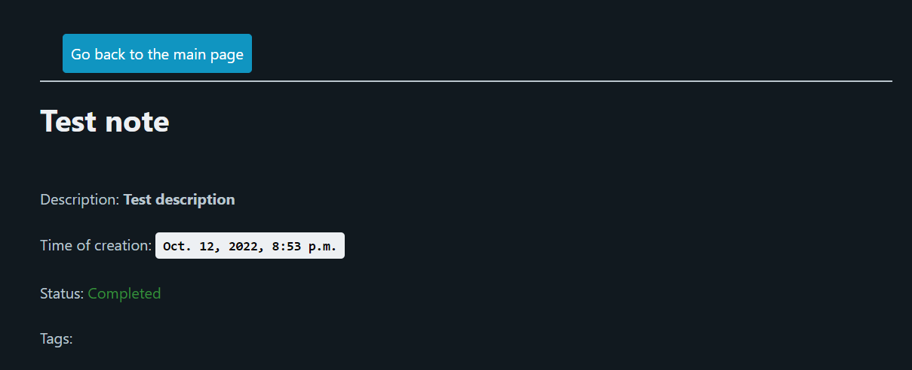

# User notes app (Django)

## Description

A simple web application for holding notes of user on **Django**, with following features:

- The app has a very simple front-end part (but not so poor back-end) basen on HTML templates rendered by `Jinja2`

- Data is stored using **SQLite** DB (created and managed using built-in Django functional). ER Diagram of
  the DB model:

- Relationship between tags and notes is implemented using `UniqueConstraint` (to provide only one possible
  relationship)

- The app has full **CRUD** functionality for viewing and managing the pictures
- For simplicity purposes validation of the input data during the registration and log in is implemented
  via HTML forms and user's password in stored in raw unencrypted form
- Docker container was created for testing deployment purposes (at `fly.io`)

## Examples of different pages

- Main page:

- Creation of a note:

- Created note:

- Note's view:

**_Kravchenko Michail_**
