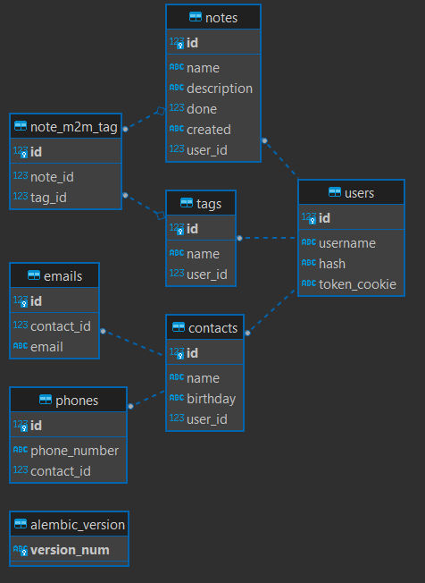
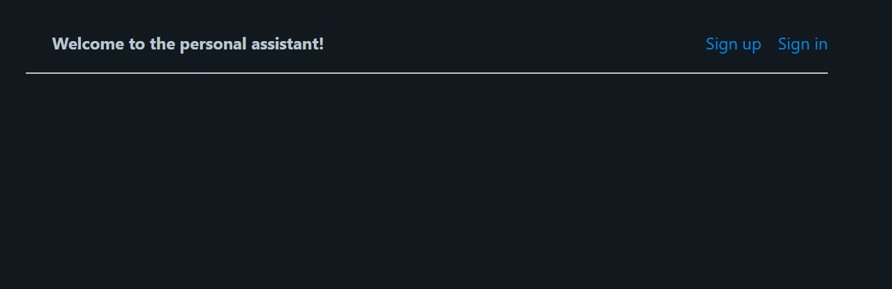
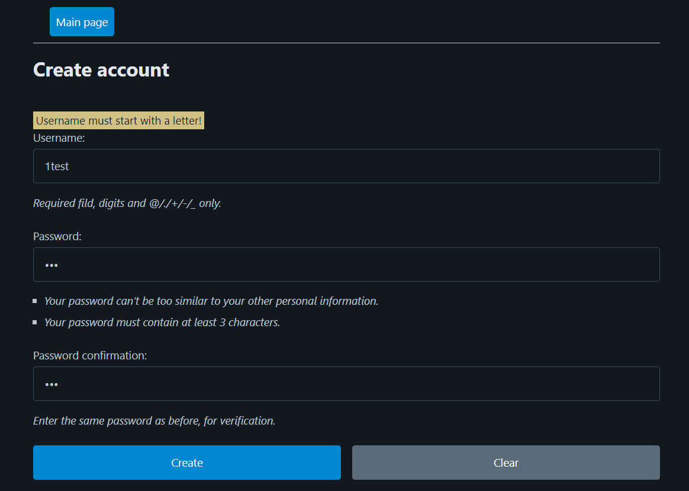
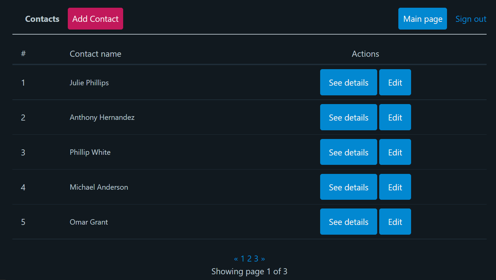
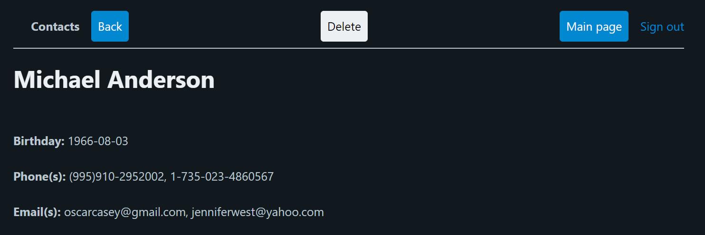
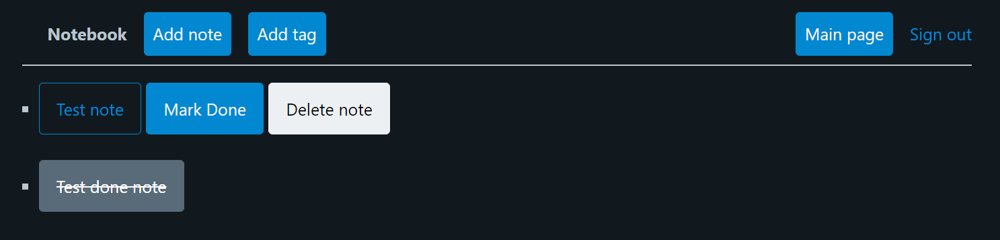
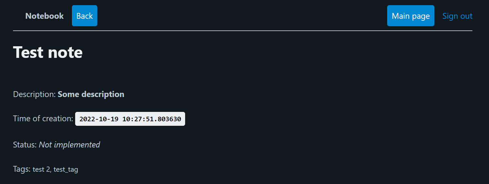

# Personal assistant (Flask)

## Description
Personal web assistant on **Flask**, with following features:

- App has two modes: **Contacts** (contact book) and **Notebook** with full CRUD functionality
- HTML templates rendered by `Jinja2` (without fully adaptive layout)
- Data is stored using **SQLite** DB (created and managed using `flask_sqlalchemy` and `flask_migrate`). ER Diagram of
  the DB model:



- Many-to-many relationship between **notes** and **tags** tables is implemented using secondary table **note_m2m_tag**
  and `UniqueConstraint('name', 'user_id')` property in class `Tag`
- Validation of the input data is done using `@validates` setters directly in db-models
- User's password is stored in encrypted way (**hash** column in the **User** table). Encryption is done
  by [`bcrypt`](https://pypi.org/project/bcrypt/):

```python
hashed = bcrypt.hashpw(password.encode('utf-8'), bcrypt.gensalt(rounds=10))
```

- "Remember me" function is implemented via cookies (`response.set_cookie`)
- Pagination is implemented when showing the contacts

```
User for testing (with filled data):
- username: test
- pswd: 123
SECRET_KEY=#r9#t6z!amVRYv
```

## Examples of pages

- Index page:



- Example of the input data validation:



- Contacts of a user:



- Contact details:



- Notes of a user:



- Description of a note:



**_Kravchenko Michail_**
