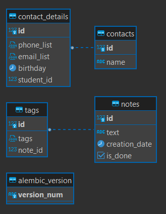
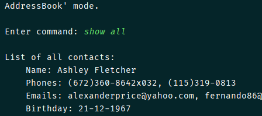
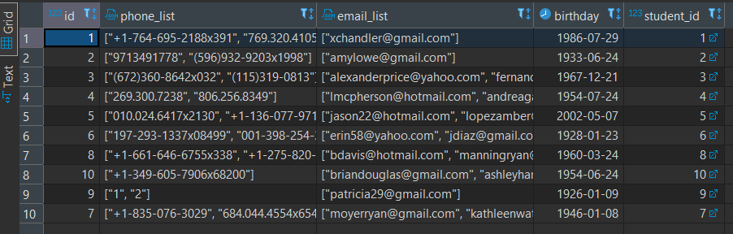

# Console bot (using PostgreSQL)

## Description

- Management of the DB and migrations are curried out using **sqlalchemy** и **Alembic**
- Phone numbers and emails of a contact and tags of notes are stored in columns of 'JSON' type to store them as usual
  lists
- Pagination is implemented for both **address book** and **notes** modes
- To run the program in terminal with command hints (`prompt_toolkit`): `py -m console_bot.main`

## DB scheme

## Results

**_Kravchenko Michail_**
