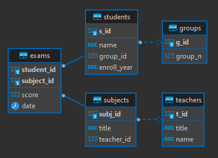
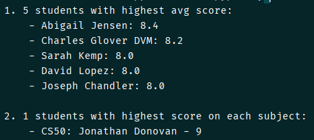

# SQL querying (PostgreSQL)

## Description

- **PostgreSQL** is used as DB
- all work is happened inside `main.py`:
    - at the beginning the initialization of the DB is happened (function `initialize()` that reads sql-script
      from `init_db.sql`)
    - then fill of the DB follows (function `fill_tables()`)
    - sql-queries themselves (function `sql_queries()`)
- distribution of grades (from 1 to 10) is generated in a way that 4 highest scores have x50 higher probability

## DB scheme

## Results

Results are printed in terminal:

**_Kravchenko Michail_**
